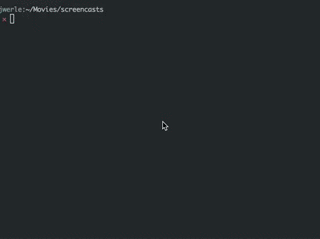

osx-screencast
==============

Easily create a screencast on OS X in a few commands.
Inspired from [this gist](https://gist.github.com/dergachev/4627207)

## install

```sh
$ bpkg install osx-screencast
```

## example



## usage

The `osx-screencast-record` command basically just opens up an
application with `open -a` defaulting to `Quicktime Player` as the
application that gets opened. The `-a` or `--application` can be used to
override this values.

### record

```sh
$ osx-screencast record
Opening `Quicktime Player'...
```

Record your screen in the application you've chosen and save the file.
You will need to know the path to the file you've saved because it will
be the `source` of the `osx-screencast-export` command.

### export

The `osx-screencast-export` command wraps the use of `ffmpeg` and
`convert` with default arguments. You can define the output fps for a video
with the `-f` or `--fps` option. The default is `10`. The delay between
each frame in the output can be defined in milliseconds with the `-d` or
`--delay` option. The default is `5`. The output scale can be defined
with the `-s` or `--scale` option. The default is `320:-1`. See [this
link](https://trac.ffmpeg.org/wiki/Scaling%20(resizing)%20with%20ffmpeg)
for more information on `ffmpeg` scaling.

```sh
$ osx-screencast export screencast.mov screencast.gif -s '720:-1'
Transcoding frames...
Converting and writing to destination...
Ok! (screencast.mov => screencast.gif)
```

## api

### osx-screencast

```
usage: osx-screenshot [-hV]
   or: osx-screenshot record [-h] [-a application]
   or: osx-screenshot export [-h] [-f fps] [-s scale] [-d delay] <src> <dest>
```
### record

```
usage: osx-screenshot-record [-h]
   or: osx-screenshot-record [-a application]

options:
   -a,--application     Set screen recording application  (Default: 'Quicktime Player')
   -h,--help            Show this message
```

### export

```
usage: osx-screenshot-export [-h]
   or: osx-screenshot-export [-f fps] [-s scale] [-d delay] <src> <dest>

options:
   -f,--fps        Frames per second (Default: 10)
   -s,--scale      Output scaling (Default: 320:-1)
   -d,--delay      Frame delay
   -h,--help       Show this message
```

## license

MIT
